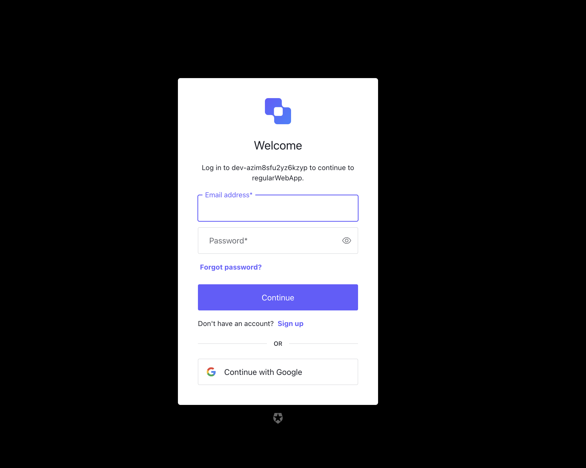

# Prva laboratorijska vježba
U prvoj laboratorijskoj vježbi proučava se autentifikacija korisnika.
Cilj je laboratorijske vježbe/projekta demonstrirati predznanje vezano za izradu web-aplikacije koja komunicira s bazom podataka, omogućiti isporuku aplikacije u oblak, a zatim u nju graditi autentifikacijske i autorizacijske mehanizme.
Aplikacija će služiti za generiranje QR kodova za ulaznice te za prikaz informacija pohranjenih u bazi podataka vezanih za pojedinu ulaznicu.

## Funkcionalni zahtjevi
- javno dostupna početna stranica koja prikazuje broj dosad generiranih ulaznica
- pristupna točka (engl. endpoint) za generiranje ulaznice
  - pristupna točka u tijelu zahtjeva prima json sa svojstvima `vatin`, `firstName` i `lastName`
  - za jedan OIB (vatin) smiju se generirati maksimalno 3 ulaznice
  - identifikator mora biti UUID iz PostgreSQL-a
  - za svaku generiranu ulaznicu u bazi podataka potrebno je dodatno pohraniti i vrijeme kreiranja ulaznice
  - rezultat uspješnog poziva je slika s QR kodom koji sadrži URL stranice određene identifikatorom ulaznice
  - u generiranom URL-u ne smiju se nalaziti podaci o OIB-u, imenu ili prezimenu
  - u slučaju pogreške vratiti status 400 ili 500 s odgovarajućim opisom pogreške
  - status 400 treba se vratiti ako ulazni json ne sadrži sve tražene podatke ili je isti OIB kupio 3 ulaznice 
  - pristupna točka mora koristiti autorizacijski mehanizam OAuth2 Client Credentials (machine-to-machine) koji je vezan za pojedinu aplikaciju, a ne korisnika
- stranica koja je jednoznačno određena identifikatorom ulaznice i prikazuje osobne podatke
  - pristup ovoj stranici imaju samo prijavljeni korisnici
  - na stranici ispisati ime trenutno prijavljenog korisnika koristeći OpenId Connect protokol

    
## O implementaciji projekta
Projekt je implementiran pomoću Node.js-a u razvojnom okruženju VSCode. Dodatno, korišten je EJS template za jednostavni prikaz i generiranje HTML-a koji je uređen pomoću CSS-a.
Projekt zahtjeva korištenje i instaliranje potrebnih biblioteka putem naredbe `npm install`. Nakon instaliranja potrebnih modula, projekt se pokreće putem naredbe `node server.js`.

# Tehnologije korištene za implementaciju

<h3>Frontend</h3>
<ul class="horizontal-list">
    <li>
        
        CSS
    </li>
    <li>
        
        HTML5
    </li>
    <li>
    
  </li>
  <li>
    
   Git
  </li>
  <li>
        
         PostgreSQL
    </li>
  <li>
     Visual Studio Code
    
  </li>
</ul>

## Upute za lokalno testiranje
### Radno okruženje 
Za radno okruženje koristi se VSCode.
- Kloniranje ili preuzimanje projekta
- Otvaranje projekta unutar VSCode odabirom odgovarajućeg direktorija
### Pokretanje projekta
- pozicionirati se unutar 1.lab direktorij
- upisati naredbu `ls` koja će ispisati sve datoteke i mape koje se nalaze u trenutnom direktoriju
- u slučaju da prethodna naredba nije ispisala `node_modules`, upisati naredbu `npm install`
- pokrenuti program naredbom `node server.js`

DISCLAIMER: Za lokalno testiranje potrebno je kreirati vlastitu bazu podataka i .env varijablu te promijeniti postavke u Auth0 aplikaciji

## Pregled funkcionalnosti

### Login

### Auth0 Login

### Create Ticket

### Submit Ticket and QRCode

### Ticket Information

## Deploy projekta
Projekt je javno dostupan na web stranici: https://nrppzw.onrender.com/