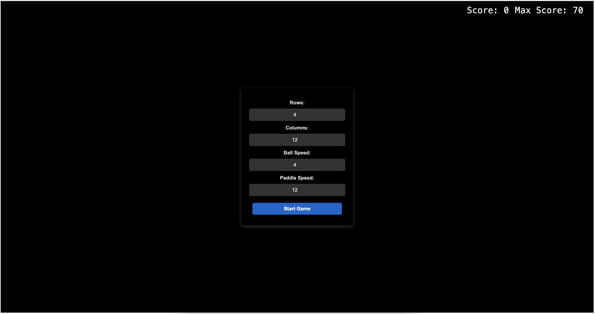
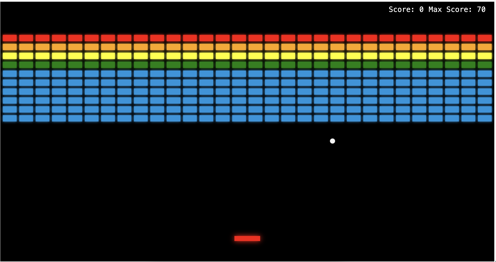
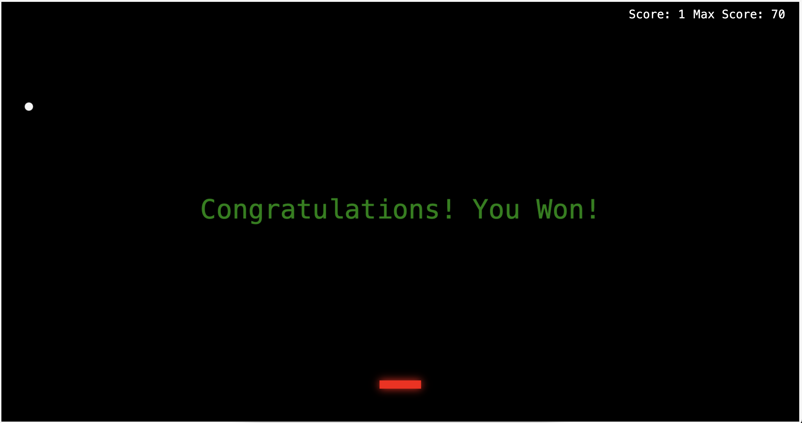
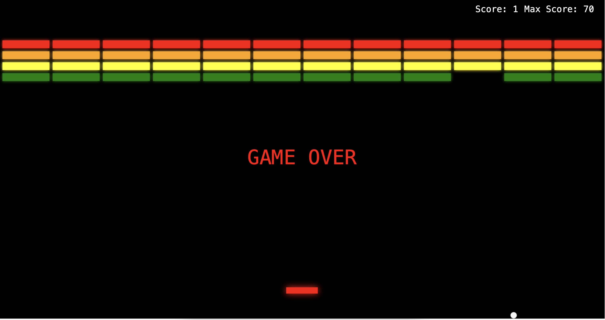

# Treća laboratorijska vježba

U trećoj laboratorijskoj vježbi proučava se izrada HTML5 web stranica.
Cilj je laboratorijske vježbe/projekta izraditit arkadnu 2D računalnu igru kao HTML5 web stranicu. 
Igra predstavlja znatno pojednostavljenu verziju arkadne igre Breakout te je izrađena pomoću HTML5 Canvas API-ja.

---
## Funkcionalni zahtjevi

- igra se prikazuje u Canvas objektu preko cijelog prozora web preglednika
- pozadina mora biti kontrastne boje (crna ili bijela)
- Canvas objekt mora imati vidljiv rub
- igra počinje odmah nakon učitavanja web stranice
- loptica se generira na središtu palice i počinje se kretati gore pod slučajnim kutom
- palicom upravlja korisnik
- loptica se kreće konstantnom brzinom i mijenja smjer prilikom udara o palicu, cigle i rubove ekrana
- objekt koji predstavlja ciglu je pravokutnik odabrane boje sa sjenom na rubovima
- palica je pravokutnik crvene boje sa sjenom na rubovima
- ako lopta izade izvan donjeg ruba ekrana, igra završava
- završetkom igre obavezno se vertikalno i horizontalno centrirano ispisuje prikladna poruka
- nakon svakog sudara s ciglom, igrač dobiva jedan bod
- mjerenje bodova
- prikaz najboljeg ostvarenog rezultata i trenutnog rezultata koji se pohranjuje u local storage

## Nefunkcionalni zahtjevi

- parametri igre mogu se konfigurirati kroz HTML5 web stranicu prije pokretanja igre
- umjesto pravokutnika moguće je koristiti sliku cigle
- generiranje zvuka za koliziju

---

## O implementaciji projekta

Projekt je implementiran korištenjem jedne HTML5 datoteke, jedne JavaScript datoteke i jedne CSS datoteke. 
Pokreće se otvaranjem HTML5 datoteke u web pregledniku.
Zvuk koji se koristi pri koliziji dobiven je [ovdje](https://sfxr.me/).
---
# Tehnologije korištene za implementaciju

<ul class="horizontal-list">
    <li>
        
        CSS
    </li>
    <li>
        
        HTML5
    </li>
    <li>
        
    </li>
  <li>
    
   Git
  </li>
     Visual Studio Code
    
  </li>
</ul>

---
## Upute za lokalno testiranje

### Pokretanje projekta
- pozicionirati se u direktorij **3.lab/**
- upisati naredbu `ls` koja treba ispisati barem **index.html**, **script.js** i **style.css**
- odabrati **index.html** i otvoriti igru u odgovarajućem pregledniku

---
## Pregled funkcionalnosti

### Pocetna stranica

### Maksimalan broj cigli

### Pobjeda

### Zavrsetak igre

---
## Deploy projekta
Projekt je javno dostupan na web stranici: 