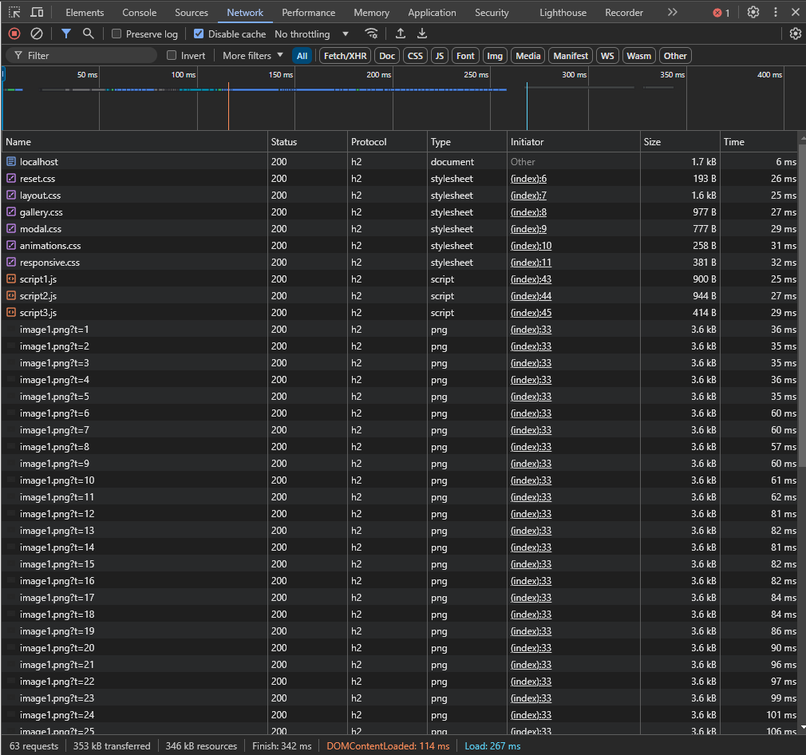
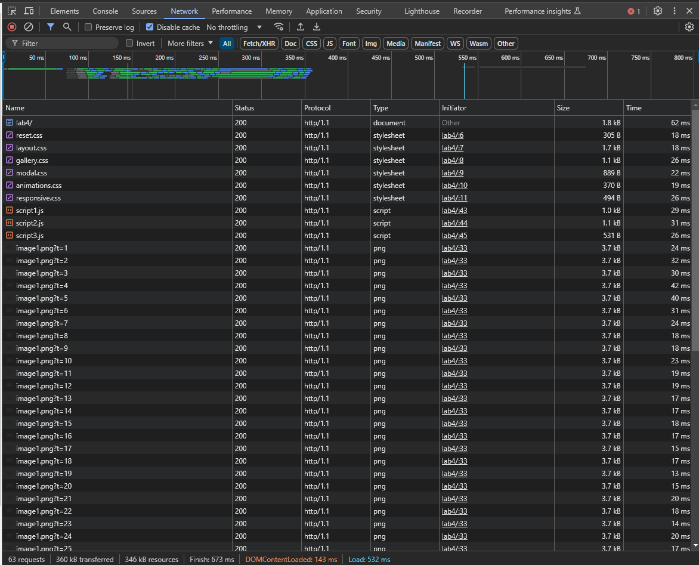

# Četvrta laboratorijska vježba

U četvroj laboratorijskoj vježbi proučava se izrada web stranice uz korištenje HTTP/2 protokola.
Cilj je laboratorijske vježbe/projekta izraditi vlastiti SSL certifikat, aktivirati HTTP/SSL, konfigurirati podršku za HTTP/2 u nginx poslužitelju, uključiti i potvrditi da je HTTP/2 uključen.

## O implementaciji projekta
Projekt je implementiran korištenjem HTML-a, JavaScripta te CSS-a. Pokreće se tako da korisnik uključi nginx poslužitelj i pokrene u web pregledniku stranicu na lokaciji `https://localhost` za HTTP/2 te `http://localhost/lab4` za HTTP/1.1

# Tehnologije korištene za implementaciju

<ul class="horizontal-list">
    <li>
        
        CSS
    </li>
    <li>
        
        HTML5
    </li>
    <li>
        
    </li>
  <li>
    
   Git
  </li>
     Visual Studio Code
    
  </li>
</ul>

## Upute za lokalno testiranje

### Pokretanje projekta
- pozicionirati se u direktorij **4.lab/**
- pokrenuti nginx poslužitelj
- otvoriti web preglednik na domeni `https://localhost` za HTTP/2 te `http://localhost/lab4` za HTTP/1.1
- otvoriti karticu **Network** u konzoli web preglednika i gledati promjenu

## Pregled funkcionalnosti

### Demonstracija HTTP/2

### Demonstracija HTTP/1.1

